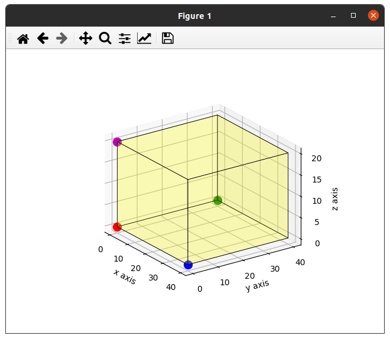
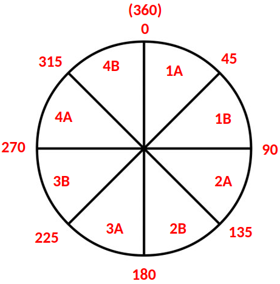
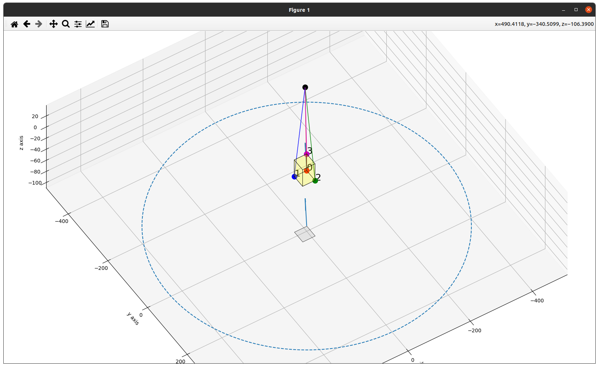
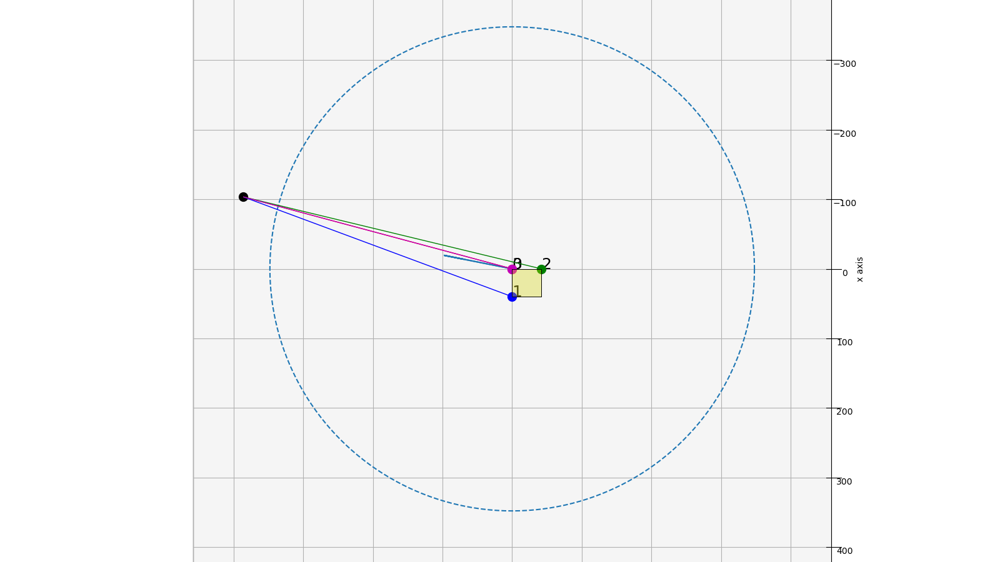

# Software

Python code to run on the SBC for to parse data from the acoustics hydrophone.

## Definitions

The forward direction is towards the direction where the front camera points.

Hydrophone positions are as follows in this picture. In short, I will refer to it as (ref, x, y, z).

- Red = Reference hydrophone
- Blue = X-offset hydrophone
- Green = Y-offset hydrophone
- Pink = Z-offset hydrophone



The bearing angle quadrants go clockwise from quadrants 1 to 4. Without trigonometry, the naive algorithm is able to distinguish up 8 possible ranges. Hence, it is referred to as A and B. After which, angle is estimated within these 8 ranges.




## hornet_acoustics_library.py

Calculation library to estimate angle of arrival (AOA) from time difference of arrival (TDOA).

First, create the library object. Parameters are hardcoded, it is the offset distances between hydrophones in centimeters.

```python
from hornet_acoustics_library import *
acoustics = Acoustics(hx=43.5, hy=47, hz=29)
```

You will receive four raw timings from CAN from hydrophones 1 to 4. Update it into the library whenever it is received.

Note that the numbering is not in sequence due to mechnical mixups, so it is ordered into (ref, x, y, z) before giving to the library.

```python
# Update values into library
hydrophone_raw_timing = [h1, h4, h2, h3] # [ref, x, y, z]
acoustics.update(hydrophone_raw_timing)
```

After updating into the library, calculate the elevation and bearing angle in degrees.

Elevation angle:
- Function return a `float`
- Negative / approaches -90 deg when pinger is directly below the AUV.
- 0 deg when the pinger is at the same depth level as the pinger
- Positive / approaches +90 deg when pinger is directly above the AUV.

```python
angle_elevation = acoustics.get_elevation_angle()
print("Elevation angle (deg):", angle_elevation)
# Example output: Elevation angle (deg): -9.238712398913
```

Bearing angle:
- Function return a `dict`
    - `{'angle': angle, 'quadrant': quadrant}`
- Goes in clockwise direction
- 0 deg when pinger is at the forward direction.
- 45 deg is to the right.
- 315 deg is to the left.
```python
angle_bearing = acoustics.get_bearing_angle()
print('Bearing angle (deg):', angle_bearing)
# Example output: Bearing angle (deg): {'angle': 66.52606582341, 'quadrant': '1B'}
```

TODO: Error detection

- Right now there may be bursts of errors occuring randomly.
- Errors can occur when when there are strong waves deflecting the signal, eg. the vehicle spins or with swimmers nearby while receiving a ping.
- I plan to add one more function, eg. `acoustics.possible_error()`.
- For example, it is erroneous when the TDOA time >> offset length of the hydrophones.


## test_can_extract.py

My testing script. Pipe the output of `candump` into the program.

It extracts the 4 hydrophone values, calls the calculation library and prints the result on the screen.

From local SBC:

    candump can0 | python3 test_can_extract.py

Alternatively from a remote host:

    sshpass -p 0rangepi ssh -XC orangepi@orangepi.local "candump can0" | python3 test_can_extract.py

## simulate_tdoa.py

Uses a 3D graph to plot a target and the vehicle with exact coordinates. From here, I can compare the real angle versus the estimated angle from library. Math checks out but it does not account for random error.





Generate 360 image using a bash loop:

    for i in {0..360..3}; do python3 simulate_tdoa.py "$i" "derp"; done
